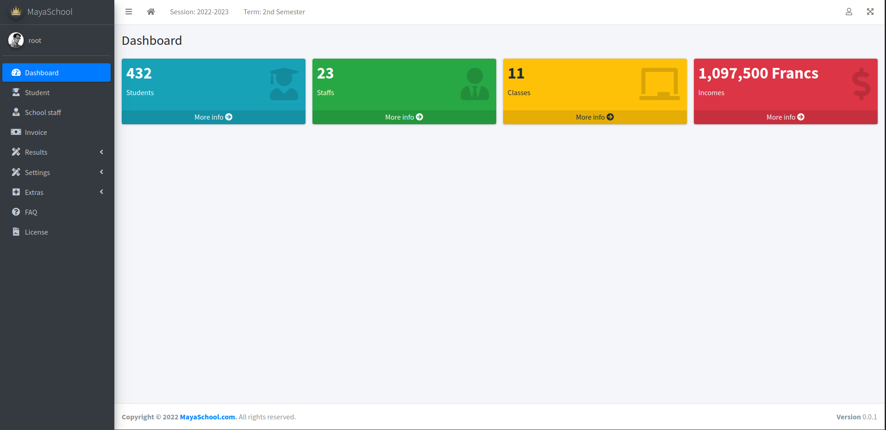

# Mayaschool
School management system.



## Installation

### Backend of mayaschool

- Download the source code
```bash
git clone -b dev https://github.com/pythonbrad/mayaschool.git --depth 1 
```

- Creating of a virtual env
```bash
python3 -m venv .maya_env
source .maya_env/bin/activate
```

- How to install the depedencies
```bash
pip install -r requirements.txt
```

- Config the environment (.env file)
```bash
cd mayaschool
cp .env_example .env
```

- How to config the database
```
python manage.py makemigrations
python manage.py migrate
```

- Config the translation
```bash
python manage.py makemessages
python manage.py compilemessages
```

- How to create an admin account
```bash
python manage.py createsuperuser
```

- How to clean the migrationq
```bash
for migration in $(find . | grep "migrations/0.*.py");do rm -f $migration; done
````

### Frontend of mayaschool

- How to install the depedencies
```bash
cd static
mkdir vendor
cd vendor
git clone --depth 1 https://github.com/ColorlibHQ/AdminLTE.git tmp
cp -r tmp/dist adminlte
cp tmp/LICENSE adminlte/LICENSE
cp -r tmp/plugins/* .
rm -rf tmp
```

### Run the project
```bash
python manage.py runserver 
```

### Demo
A demo is available on [here](http://pythonbrad.pythonanywhere.com/).
Username: root
Password: root

## [License](LICENSE.md)
